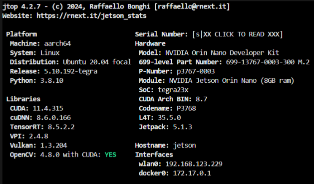
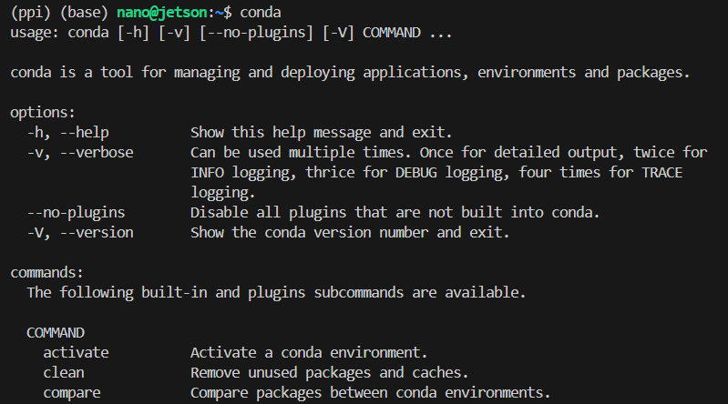
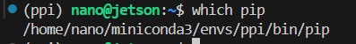
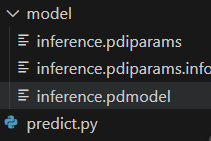
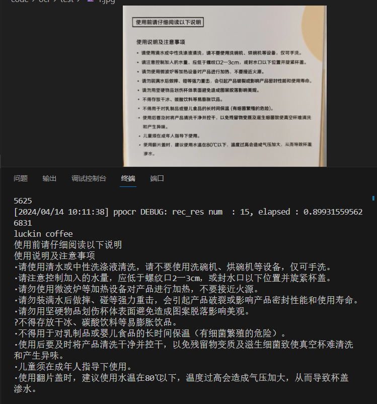

# nano部署ppocr教程
## 引入
此次在Orin Nano部署paddle的机会得益于学长自费4k块买下的板卡，由于网上搜不到什么有价值的教程，又踩了很多坑，特意写下这篇教程。以下是环境展示，不同配置也可参考本篇教程，paddle对jetson的支持可以说是相当不错

## 环境配置
### Jetpack
本文采用的是jetpack5.1.3版本，本篇教程>=5.1.1操作完全相同，本文采用[jetpack5.1.3](https://developer.nvidia.com/embedded/jetpack-sdk-513)，这里不过多介绍。
### Conda
由于某些库依赖的版本不太一样`如opencv`，所以如果不是在纯净的python3.8环境的话，本人建议在conda环境下安装，conda是很好的py环境管理器，学会它对你的py开发大有帮助。当然，如果你自信没有冲突的话，可以跳过这一步。

#### Miniconda
这里比较推荐[Miniconda](https://docs.anaconda.com/free/miniconda/index.html)，与Anaconda的功能没有差距，但预装的内容更少，比起Anaconda更加轻量  
##### 安装conda
以下是快捷安装指令，需要注意的是我们安装的是aarch64版本
```
#安装指令
mkdir -p ~/miniconda3
wget https://repo.anaconda.com/miniconda/Miniconda3-latest-Linux-aarch64.sh -O ~/miniconda3/miniconda.sh
bash ~/miniconda3/miniconda.sh -b -u -p ~/miniconda3
rm -rf ~/miniconda3/miniconda.sh

#环境配置
~/miniconda3/bin/conda init bash
~/miniconda3/bin/conda init zsh
```
**请在完成以上指令后关闭当前终端并打开一个新终端**
```
#输入以下指令
conda
```
安装成功的效果图应该如下

#### 新建py3.8的环境
```
conda create -n ppi python=3.8
conda activate ppi
```

### Paddle Inference
Paddle Inference 是飞桨的原生推理库，提供服务器端的高性能推理能力。由于 Paddle Inference 能力直接基于飞桨的训练算子，因此它支持飞桨训练出的所有模型的推理。
#### 环境检查
如果你使用了conda，请用以下指令检查当前使用的pip是否来自你conda里的py3.8版本
```
which pip
```

#### 安装
这里只讲2.6版本的Paddle Inference安装，需要其它版本可以参考[官网](https://www.paddlepaddle.org.cn/inference/master/guides/introduction/index_intro.html)

>Python 推理库

|版本说明|python3.8|
| --- | --- |
|Jetpack5.1.1: nv-jetson-cuda11.4-cudnn8.6.0-trt8.5.2-jetpack5.1.1-all|[paddlepaddle_gpu-2.6.0-cp38-cp38m-linux_aarch64.whl](https://paddle-inference-lib.bj.bcebos.com/2.6.0/python/Jetson/jetpack5.1.1_gcc9.4/all/paddlepaddle_gpu-2.6.0-cp38-cp38-linux_aarch64.whl)|

这里选择的是这个版本，如果你的jetpack版本较老，可自行前往[官网](https://www.paddlepaddle.org.cn/inference/master/guides/introduction/index_intro.html)寻找合适的版本  
下面是快捷安装指令
```
wget https://paddle-inference-lib.bj.bcebos.com/2.6.0/python/Jetson/jetpack5.1.1_gcc9.4/all/paddlepaddle_gpu-2.6.0-cp38-cp38-linux_aarch64.whl
pip install paddlepaddle_gpu-2.6.0-cp38-cp38-linux_aarch64.whl
rm -rf paddlepaddle_gpu-2.6.0-cp38-cp38-linux_aarch64.whl
```
你可以简单地通过`import paddle`来检查是否安装成功
### PaddleOCR
相信有打过线上赛的同学对PPOCR很熟悉吧，这里的方法和做线上赛的sub区别不大，PPOCR的效果还是很顶的。到这里我们的环境基本配置好了，安装也特别容易。
#### 安装
```
pip install "paddleocr>=2.0.1" # 推荐使用2.0.1+版本
```
若无报错则安装成功
## 使用Demo
### 文件结构


model里存放用来预测的rec模型，这里推荐

|模型名称|模型简介|推理模型大小|下载地址|
| --- | --- | --- | --- |
|ch_PP-OCRv4_server_rec|【最新】高精度模型，支持中英文、数字识别| 88M |[推理模型](https://paddleocr.bj.bcebos.com/PP-OCRv4/chinese/ch_PP-OCRv4_rec_server_infer.tar) |

这个模型也是我们线上赛的老伙伴了  
如果你需要存放其它类型的模型也可以，这里只是针对以下示例代码
### 代码示例
下面是一个简单的predict代码示例
```
from paddleocr import PaddleOCR

#初始化ocr
ocr = PaddleOCR(lang='ch',
                rec_model_dir='./model'
                )

def get_result(image:str)->str:
    """获取预测结果"""
    result = ocr.ocr(image)
    text = ""
    for i in result[0]:
        text += i[1][0]+'\n'
    return text

#设置预测图片路径，这里建议使用绝对路径
img="/home/nano/code/ocr/test/1.jpg"

print(get_result(img))
```

请在img变量中自己设置需要预测的图片的路径，运行效果如图


至此本篇教程结束
## 结语
曾经淋雨时他人为我撑过伞，如今我也想为他人撑伞。
